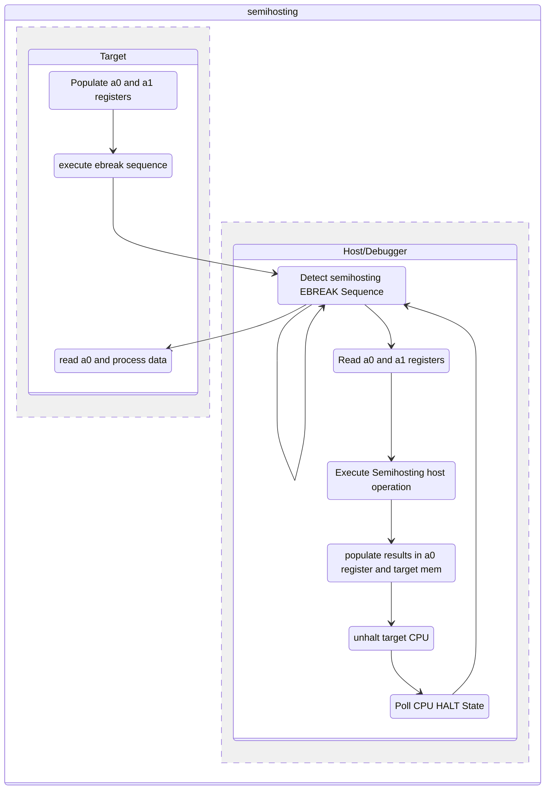

<style>
div {
  text-align: justify;
  text-justify: inter-word;
}
</style>





As an embedded system developer, you would be very familiar with the use of a debugger to step through code or using UART-based `printf()` statements to print to the console. However, what if you want to print to the console or perform file I/O operations from your embedded system? Semihosting lets you do just that. Semihosting lets embedded systems talk to a host computer through a debugger interface to perform tasks such as file I/O, and printing to the console. This article explains how semihosting is implemented on RISC-V and we get hands-on using a RSIC-V QEMU model and some bare metal code.

## What is semihosting?

Semihosting is a mechanism that allows a debugger to communicate with a target system. It uses a clever combination of code running on the target system and a debugger to perform tasks such as file I/O, and printing to the console. Semihosting was first defined by ARM in 1995 and is available today as the [ARM Semihosting Specification](https://developer.arm.com/documentation/100863/latest). It is implemented by many debuggers and is supported in many libraries. 

Essentially, semihosting depends on placing some information on a debugger-readable memory location and then executing a breakpoint instruction. The debugger can then read the information and perform the requested task. The target system can then continue execution after the breakpoint instruction. If the debugger wants to provide return information back to the target (like data read from a file), it can do so by writing to the same memory location. When continuing execution, the target system can read the return information from the memory location.

## How does semihosting work on RISC-V?

Semihosting is implemented on RISC-V by using the `ebreak` instruction. The `ebreak` instruction is a breakpoint instruction that is used to halt the processor. The RISC-V spec uses a cleaver trick of "wrapping" the `ebreak` instruction with additional instructions that helps the debugger distinguish a "semihosting `ebreak`" from a "regular `ebreak`".

Specifically, the following piece of code is used to implement semihosting on RISC-V:

```asm
slli x0, x0, 0x1f # Entry NOP
ebreak # Break to debugger
srai x0, x0, 7 # NOP encoding the semihosting call number 7
```

The data exchange format uses the same ARM semihosting specification. 

This is what the RISC-V spec says about semihosting (from Sec `2.8` of `Volume I: RISC-V Unprivileged ISA V20191213`):

> `EBREAK` was primarily designed to be used by a debugger to cause execution to stop and fall
back into the debugger. `EBREAK` is also used by the standard gcc compiler to mark code paths
that should not be executed.<p>
Another use of `EBREAK` is to support `“semihosting”`, where the execution environment includes
a debugger that can provide services over an alternate system call interface built around
the EBREAK instruction. Because the RISC-V base ISA does not provide more than one
`EBREAK` instruction, RISC-V semihosting uses a special sequence of instructions to distinguish
a semihosting `EBREAK` from a debugger inserted `EBREAK`.<p>
```asm
slli x0, x0, 0x1f # Entry NOP
ebreak # Break to debugger
srai x0, x0, 7 # NOP encoding the semihosting call number 7
```
>Note that these three instructions must be 32-bit-wide instructions, i.e., they mustn’t be among
the compressed 16-bit instructions described in Chapter 16.<p>
The shift NOP instructions are still considered available for use as HINTS.<p>
Semihosting is a form of service call and would be more naturally encoded as an `ECALL`
using an existing ABI, but this would require the debugger to be able to intercept `ECALLs`, which
is a newer addition to the debug standard. We intend to move over to using `ECALLs` with a
standard ABI, in which case, semihosting can share a service ABI with an existing standard.<p>
We note that ARM processors have also moved to using `SVC` instead of `BKPT` for semihosting
calls in newer designs.

## So what can we do with semihosting?

The spec defines 24 semihosting calls. The following table shows the semihosting calls and their description:

| Category | Semihosting calls | Description |
|----------|-------------------|-------------|
| File I/O |`SYS_OPEN`, `SYS_WRITE`, `SYS_CLOSE`, `SYS_FLEN`, `SYS_SEEK`,  `SYS_ISTTY`, `SYS_READ`, `SYS_REMOVE`, `SYS_RENAME`, `SYS_TMPNAM` | Operate on files in the host file system. |
| Console I/O | `SYS_WRITEC`, `SYS_WRITE0`, `SYS_READC` | Read/Write on the console. The console is implemented by the debugger. For QEMU, it can be routed to STDIO, GDB uses its own console etc.|
|Status | `SYS_ISERROR`, `SYS_HEAPINFO`, `SYS_ERRNO` | Get information about the status of the target system. |
| control status | `SYS_EXIT`, `SYS_EXIT_EXTENDED`, `SYS_GET_CMDLINE` | Control the target system. |
| system commands | `SYS_SYSTEM` | Execute a system command on the host. |
| clock | `SYS_CLOCK`, `SYS_TIME`, `SYS_ELAPSED `, `SYS_TICKFREQ ` | Get information about the clock on the target system. expect skews since communication is over JTAG|

## The mechanics of arguments and return values

Each semihosting call is identified by a number. This number will be placed in the `a0` register before the semihosting ebreak sequence is performed. If the operation requires arguments, they will be placed in the system memory and the address will be placed in the `a1` register. The debugger will place the return value in the `a0` register before "un-halting" the CPU from the `EBREAK` instruction.

The following diagram shows the semihosting sequence. On the left is the target system and on the right is the debugger:



Lets see semihosting in action

## Setting up the toolchain and development environment

As usual, lets start with a clean ubuntu machine. Install basic tools with the following command:

```bash
sudo apt-get install -y build-essential git wget
```

Then we install the RISC-V elf toolchain (a.k.a the baremetal toolchain). We will use the pre-built toolchain packaged for Ubuntu and install it with the following commands:

```bash
sudo apt-get install -y gcc-riscv64-unknown-elf
```

Just the compiler is not enough to compile baremetal programs. We need a linker script and a startup file along with a library which provides the standard C library functions. You can install these on ubuntu with the following commands. Since our intent is to understand semihosting and not building the baremetal infrastructure, we will use the pre-built libraries and linker scripts provided by the [picolibc](https://github.com/picolibc/picolibc) project. The `picolibc` project also has native semihosting support. However, we will not be using it in this tutorial. We will be building our own target semhosting infrastructure.

Install `picolibc` with the following command:

```bash
sudo apt-get install -y picolibc-riscv64-unknown-elf

```

In ubuntu, the files are installed under `/usr/lib/picolibc/riscv64-unknown-elf/`. We will be using this path in teh next section

(You can find this for any package with `dpkg -L <package name>`)

### Generating baremetal images

You can compile C code to generate statically linked images for RSICV using this command

```bash
riscv64-unknown-elf-gcc -specs=/usr/lib/picolibc/riscv64-unknown-elf/picolibc.specs main.c
```

However, this generates images targeted for execution from the RAM entry point address `0x10000000`. This might not work out for all machines, especially the RISCV Virt machine that we plan to use. 

You can check the ELF header of the generated image with :

```bash 
riscv64-unknown-elf-readelf a.out -h
```

In the case using the default spec, you would see 

```
ELF Header:
  Magic:   7f 45 4c 46 02 01 01 00 00 00 00 00 00 00 00 00
  Class:                             ELF64
  Data:                              2's complement, little endian
  Version:                           1 (current)
  OS/ABI:                            UNIX - System V
  ABI Version:                       0
  Type:                              EXEC (Executable file)
  Machine:                           RISC-V
  Version:                           0x1
  Entry point address:               0x10000000
  Start of program headers:          64 (bytes into file)
  Start of section headers:          9224 (bytes into file)
  Flags:                             0x5, RVC, double-float ABI
  Size of this header:               64 (bytes)
  Size of program headers:           56 (bytes)
  Number of program headers:         4
  Size of section headers:           64 (bytes)
  Number of section headers:         19
  Section header string table index: 18
```

The QEMU RSICV virt model RAM (and execution) starts at `0x80000000`. You can check this in the [hw/riscv/virt.c](https://github.com/qemu/qemu/blob/ea3a008d2d9ced9c4f93871c823baee237047f93/hw/riscv/virt.c#L95) file.

So, in order to re-target the binary, we need to create a linker script with the following contents. 

```ld
__flash = 0x80000000;
__flash_size = 0x00080000;
__ram = 0x80080000;
__ram_size = 0x40000;
__stack_size = 1k;

INCLUDE picolibc.ld
```

Now we can compile images that would execute from the required location by passing this linker script using the `-T` argument. A sample is given below:

```bash
riscv64-unknown-elf-gcc -specs=/usr/lib/picolibc/riscv64-unknown-elf/picolibc.specs main.c -Tvirt.ld
```

The new ELF header would look like this: (Note the change in the `Entry point address`)

```
ELF Header:
  Magic:   7f 45 4c 46 02 01 01 00 00 00 00 00 00 00 00 00
  Class:                             ELF64
  Data:                              2's complement, little endian
  Version:                           1 (current)
  OS/ABI:                            UNIX - System V
  ABI Version:                       0
  Type:                              EXEC (Executable file)
  Machine:                           RISC-V
  Version:                           0x1
  Entry point address:               0x80000000
  Start of program headers:          64 (bytes into file)
  Start of section headers:          9392 (bytes into file)
  Flags:                             0x5, RVC, double-float ABI
  Size of this header:               64 (bytes)
  Size of program headers:           56 (bytes)
  Number of program headers:         4
  Size of section headers:           64 (bytes)
  Number of section headers:         19
  Section header string table index: 18
```

### Getting QEMU

For running semihosting on RISC-V with usermode support, we would need QEMU version 7.2 or later [Ref](https://patchwork.kernel.org/project/qemu-devel/list/?series=667741&archive=both&state=*). You get the latest source from the [QEMU git repository](https://git.qemu.org/?p=qemu.git;a=summary).

To compile from source, you can use the following commands:

First get the build dependencies:

```bash
sudo sed -i 's/# deb-src/deb-src/' /etc/apt/sources.list
sudo apt update
sudo apt -y build-dep qemu
```

Then clone, checkout and build QEMU:

```bash
git clone https://git.qemu.org/git/qemu.git
cd qemu
git checkout v7.2.0
./configure --target-list=riscv64-softmmu
make -j8
```

QEMU will be built in the `riscv64-softmmu` directory. You can run the following command to check if QEMU is working:

```bash
./build/qemu-system-riscv64 --version
```

Export the path to the QEMU binary to the `PATH` variable:

```bash
export PATH=$(pwd)/build:$PATH
```


## Writing a simple C program to implement semihosting

Now that we have the toolchain, lets write a simple C program to implement semihosting. We will implement a `semihosting_write` function that will write a string to the console and a `semihosting_open` , `semihosting_write` and `semihosting_close` functions that will write a string to a file.

```c
#include <stdio.h>
#include <string.h>
#define SH_FILE_MODE_WPLUS 6

#define APP_SH_TEST_STR_LENGTH 25

enum semihosting_operation_numbers
{

	SH_SYS_OPEN = 0x01,
	SH_SYS_CLOSE = 0x02,
	SH_SYS_WRITE0 = 0x04,
	SH_SYS_WRITE = 0x05,
};

/*REF: https://groups.google.com/a/groups.riscv.org/g/sw-dev/c/n-5VQ9PHZ4w/m/KbzH5t9MBgAJ */
static inline int __attribute__((always_inline)) sys_sh(int reason, void *argPack)
{
	register int value asm("a0") = reason;
	register void *ptr asm("a1") = argPack;
	asm volatile(
		// Force 16-byte alignment to make sure that the 3 instructions fall
		// within the same virtual page.
		" .balign 16    \n"
		" .option push \n"
		// Force non-compressed RISC-V instructions
		" .option norvc \n"
		// semihosting e-break sequence
		" slli x0, x0, 0x1f \n" // # Entry NOP
		" ebreak \n"			// # Break to debugger
		" srai x0, x0,  0x7 \n" // # NOP encoding the semihosting call number 7
		" .option pop \n"
		/*mark (value) as an output operand*/
		: "=r"(value) /* Outputs */
		// The semihosting call number is passed in a0, and the argument in a1.
		: "0"(value), "r"(ptr) /* Inputs */
		// The "memory" clobber makes GCC assume that any memory may be arbitrarily read or written by the asm block,
		//  so will prevent the compiler from reordering loads or stores across it, or from caching memory values in registers across it.
		//  The "memory" clobber also prevents the compiler from removing the asm block as dead code.
		: "memory" /* Clobbers */
	);
	return value;
}

// function to write a NULL terminated string to the console
void sh_write0(const char *buf)
{
	// Print zero-terminated string
	sys_sh(SH_SYS_WRITE0, (void *)buf);
}

// function to open a file.
//  A real implementation would keep track of the file handle.
//     and also check the validity of the input passed on to the function.
int sh_open(const char *filename, int mode)
{
	uintptr_t argPack[3];
	argPack[0] = (uintptr_t)filename;
	argPack[1] = (uintptr_t)(mode);
	argPack[2] = (uintptr_t)strlen(filename);

	int file_handle = sys_sh(SH_SYS_OPEN, (void *)argPack);
	return file_handle;
}

// function to close a file
int sh_close(int file_handle)
{
	uintptr_t argPack[1];
	argPack[0] = file_handle; // To prevent compiler warning
	int res = sys_sh(SH_SYS_CLOSE, (void *)argPack);
	return res;
}

// function to write to a file
// A real implementation would keep track of the number of bytes written and the position.
//     and also check the validity of the input passed on to the function.
int sh_write(int file_handle, const char *buf, int len)
{
	// Write to file
	uintptr_t argPack[3];
	argPack[0] = (uintptr_t)file_handle;
	argPack[1] = (uintptr_t)buf;
	argPack[2] = (uintptr_t)len;
	int res = sys_sh(SH_SYS_WRITE, (void *)argPack);
	return res;
}

int main()
{

	// write a string to the console with semihosting
	sh_write0("Hello semihosting-World\r\n");

	// open a file and write a string to it
	int file_handle = sh_open("test.txt", SH_FILE_MODE_WPLUS);
	if (file_handle == -1)
	{
		goto exit;
	}
	int retval = sh_write(file_handle, "Hello semihosting-World\r\n", APP_SH_TEST_STR_LENGTH);
	if (retval == -1)
	{
		goto exit;
	}
	else
	{
		sh_write0("Wrote text to file\r\n");
	}
	sh_close(file_handle);
exit:
	return 0;
}
```

## Building the code

We can build the code using the following command:

```bash
riscv64-unknown-elf-gcc -specs=/usr/lib/picolibc/riscv64-unknown-elf/picolibc.specs main.c -Tvirt.ld -mcmodel=medany
```

Notice the additional `-mcmodel=medany` flag? This is what the GCC manual says about this:

> `-mcmodel=medlow` :Generate code for the medium-low code model. The program and its statically defined symbols must lie within a single 2 GiB address range and must lie between absolute addresses -2 GiB and +2 GiB. Programs can be statically or dynamically linked. This is the default code model<p>
`-mcmodel=medany` :Generate code for the medium-any code model. The program and its statically defined symbols must be within any single 2 GiB address range. Programs can be statically or dynamically linked.<p>
The code generated by the medium-any code model is position-independent, but is not guaranteed to function correctly when linked into position-independent executables or libraries.

## Running the program

Now we can run the program using the following command:

```bash
qemu-system-riscv64 -bios  a.out -M virt -display none \
                    -chardev stdio,id=stdio0 \
                    -semihosting-config enable=on,userspace=on,chardev=stdio0
```

The expected output is:

```bash
Hello semihosting-World
Wrote text to file
```

Now you can see that a file named `test.txt` has been created in the current directory in the host machine.

As you would have noticed, the code does not implement a UART driver and QEMU is not instantiating a `serial chardev backend`. This print is coming via the semihosting infrastructure and not from the UART.

In a real machine (unlike the emulated one here), When a debugger is connected to the target, the semihosting output is redirected to the debugger console. File I/O is also redirected to the debugger which then performs the file I/O operations on the host machine.

## Using picolibc semihosting support

The picolibc library has support for semihosting. This means that we can use the standard C library functions to perform semihosting operations. In order to perform a semihosted `printf()` using picoLibc, include the `--oslib=semihost` flag when building the code. This will link the semihosting support library to the application.

For instance, consider the following code:

```c
#include <stdio.h>
int main()
{
  printf("Hello semihosting-World\r\n");
  return 0;
}
```

You can compile it with 

```bash
riscv64-unknown-elf-gcc -specs=/usr/lib/picolibc/riscv64-unknown-elf/picolibc.specs -Tvirt.ld -mcmodel=medany --oslib=semihost test.c
```

and run it with

```bash
qemu-system-riscv64 -bios  a.out -M virt -display none \
                    -chardev stdio,id=stdio0 \
                    -semihosting-config enable=on,userspace=on,chardev=stdio0
```

To get this output:

```bash
Hello semihosting-World
````

Without the `--oslib` flag, it will not be possible to use the `printf` function. 

```bash
/usr/lib/riscv64-unknown-elf/bin/ld: /usr/lib/picolibc/riscv64-unknown-elf/lib/rv64imafdc/lp64d/libc.a(libc_tinystdio_puts.c.o): in function `puts':
./riscv64-unknown-elf/../../../newlib/libc/tinystdio/puts.c:41: undefined reference to `stdout'
collect2: error: ld returned 1 exit status
```

Similarly, you can use the `fopen`, `fwrite` and `fclose` functions to perform semihosted file I/O.

```c
#include <stdio.h>
#include <stdlib.h>
int main()
{
	  FILE* fp;
	  fp=fopen("test.txt", "w");
	  fprintf(fp, "Hello World!");
	  fclose(fp);
}
```

### How does this override work?

This is done in `picolibc` by using the `__attribute__((weak))` attribute. This attribute allows the user to override the default implementation of a function. The default implementation of the semihosting functions is provided by the picolibc library. The user can override the default implementation by providing their own implementation.

## How fast can semihosting be?

Semihosting is often performed over JTAG and includes a lot of overhead. This means that semihosting is not suitable for high performance applications. However, semihosting is still useful for debugging and prototyping. It is not expected to be even compiled into a production system.

## EBREAK trap vs halt

The debug control and status register in the RISC-V debug specification provides provisions to control wether the target should halt on an `EBREAK` instruction or not. This is controlled by the `ebreakm`, `ebreaks` and `ebreaku` bits in the `dcsr` register. The `ebreakm` bit controls the behavior of EBREAK instructions in machine mode and the `ebreaku` bit controls the behavior of EBREAK instructions in user mode etc. There are also `mcontrol` registers which can be used to control the address of the instruction to be executed when the target enters debug mode. There are more interesting features in the debug specification which can be used to control the target behavior. You can read more about it [here](https://github.com/riscv/riscv-debug-spec).