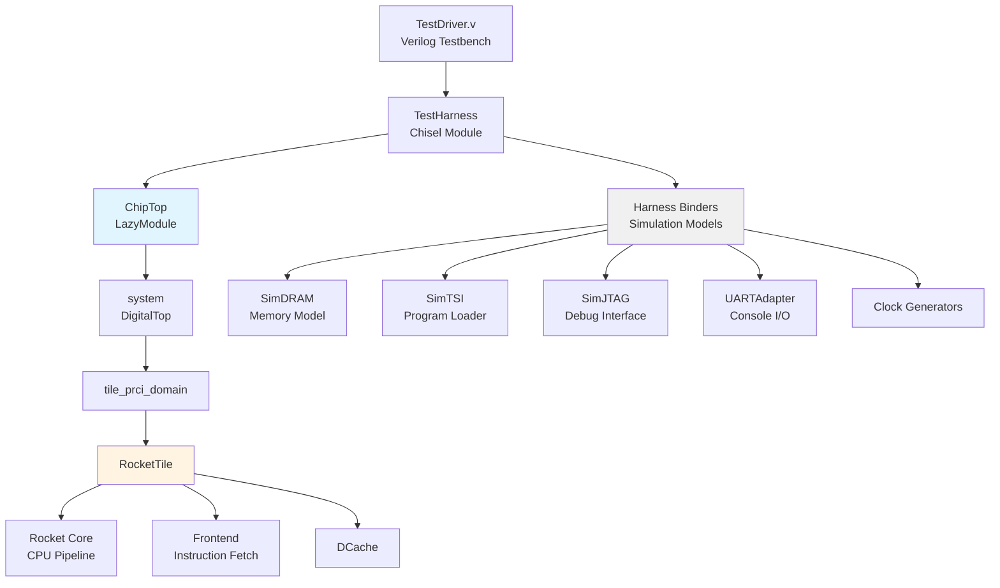
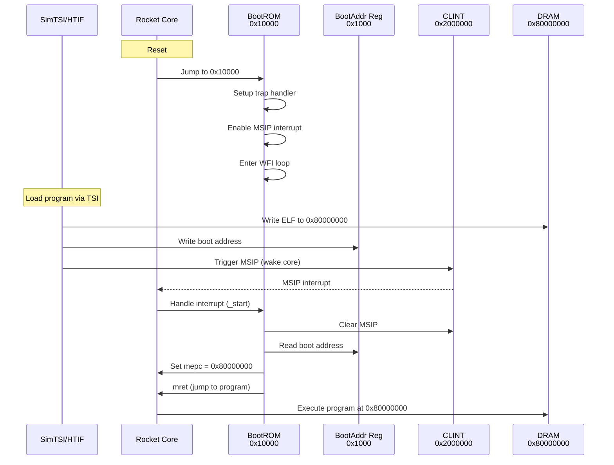
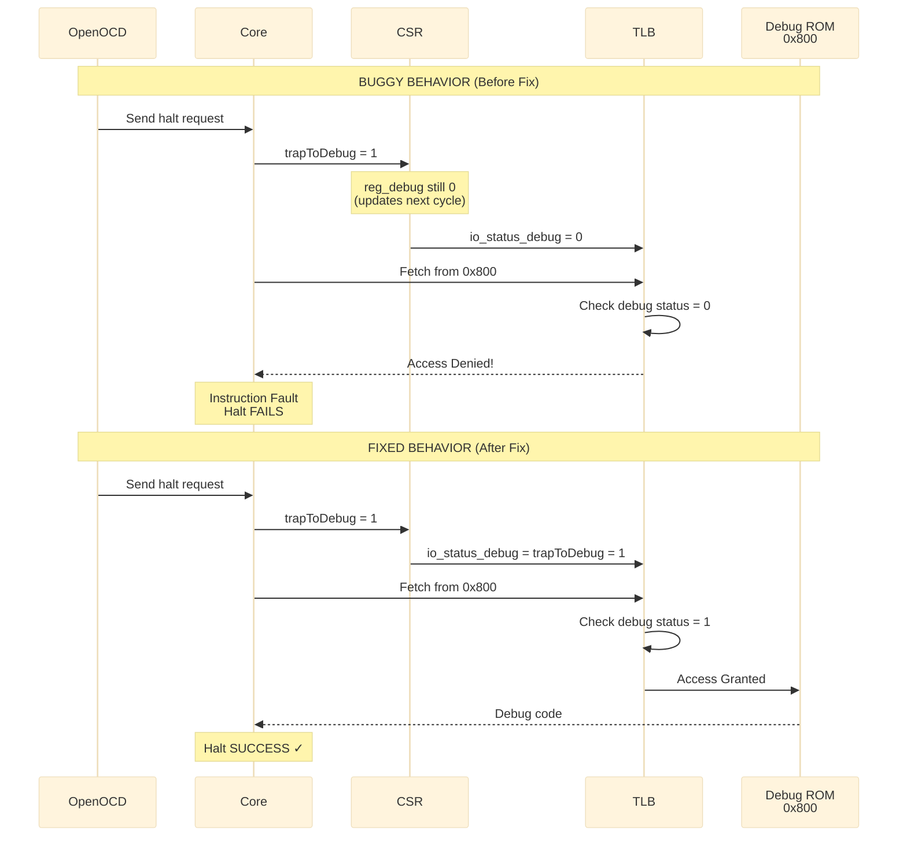

<style>
div {
  text-align: justify;
  text-justify: inter-word;
}
</style>



Chipyard is an open-source framework for designing, simulating, and testing RISC-V processors and systems-on-chip (SoCs). It comes with a few flavors of RISC-V cores, including Rocket, BOOM, and others. It also comes with a lot of pre-built components and tools to help you get started quickly. Because Chipyard supports building production-grade core configurations that can work with industry standard EDA tools, as well as hobbyist-grade verilator models and FPGA targets, it is a great choice for both learning and professional development. However, this also makes the learning curve a bit steep for beginners.

When I initially started working with Chipyard, I made the naive assumption that I could simply clone the repository, run a few commands, and have a working RISC-V processor in no time. Little did I know that I will have to go implement a fix deep within the RocketCore CSRs to get this running. That was a fun learning experience though, and I am documenting the entire journey here for anyone else who might be interested in replicating this setup.

## TL;DR Incident report

**Problem**: OpenOCD could not halt the Rocket Core, showing "Hart failed to halt" error, completely blocking all JTAG debugging.

**Root Cause**: A timing race condition where the TLB checked debug status one cycle before it was updated, causing it to deny access to the Chipyard debug ROM at address 0x800.

**Fix**: Changed `io.status.debug` from being driven by a registered signal (`reg_debug`) to a combinational signal (`trapToDebug`), making debug status visible in the same cycle as the debug exception.

**Impact**: Enables JTAG debugging to work correctly. The fix is minimal (one line), has no performance cost, and aligns with the architectural intent that debug mode should be visible immediately when a debug exception is taken.

I will go into more details of how I fixed this issue later in the post.

## Objectives and Background

The objective we are setting out to achieve is to:

  1. Build a simple RISC-V processor using Chipyard.
  2. Simulate it using verilator.
  3. Write, and build a custom test program to run on our core.
  4. Run the test program on the simulated core.
  5. Attach a debugger to the running core.
  6. Step through the program using the debugger.

Yeah, as I stated earlier, I was naive. But hey, where is the fun in taking the easy route ?

I thought I knew how RISC-V debug works but I was wrong. I had to learn a lot more about how RISC-V debug works in order to get everything working with Chipyard.

When I first brought up a rocket core back in 2020 on an FPGA to boot linux, Chipyard was in its infancy and I used the rocket core repo directly.  You can find my old blog post about that [here](https://embeddedinn.com/articles/tutorial/booting-my-first-RISC-V-core-on-an-FPGA/). Since then, Chipyard has matured a lot and now provides a much better framework for building RISC-V processors and systems.

Chipyard is built on top of several other open-source projects. The documentation says:

> Chipyard is a framework for designing and evaluating full-system hardware using agile teams. It is composed of a collection of tools and libraries designed to provide an integration between open-source and commercial tools for the development of systems-on-chip

It is essentially a one-stop-shop for RISC-V SoC design. It integrates with several other projects including Rocket Chip, BOOM, FireSim, and more.

## Environment setup

To install dependencies with the following steps:

```bash
# Update System
sudo apt-get update
sudo apt-get upgrade -y

# Install Build Tools
sudo apt-get install -y build-essential bison flex software-properties-common curl git \
    libgmp-dev libmpfr-dev libmpc-dev zlib1g-dev vim device-tree-compiler \
    libboost-regex-dev libboost-system-dev \
    libtool libtool-bin autoconf automake pkg-config texinfo gperf libusb-1.0-0-dev
```

Chipyard uses Conda to manage its dependencies.

```bash
# Download Miniforge (conda alternative)
curl -L -O "https://github.com/conda-forge/miniforge/releases/latest/download/Miniforge3-$(uname)-$(uname -m).sh"

# Install
bash Miniforge3-$(uname)-$(uname -m).sh -b

# Initialize conda
source ~/miniforge3/bin/activate
conda init

# IMPORTANT: Restart your terminal after this step
```

**After restarting terminal:**

```bash
# Install conda-lock (CRITICAL for Chipyard build-setup)
conda install -n base -c conda-forge conda-lock
```

Next, clone the Chipyard repository and initialize the submodules:

```bash
git clone [https://github.com/ucb-bar/chipyard.git](https://github.com/ucb-bar/chipyard.git)
cd chipyard
git checkout 1.13.0


# Initialize Submodules and build setup
./build-setup.sh riscv-tools

#build openocd
./scripts/build-openocd.sh

# Source the environment variables
source env.sh
```

This script will take a while to complete as it downloads dependencies and submodules and builds a few.

## Understanding Chipyard structure and configurations

Before we proceed to build our RISC-V processor, it's important to understand the structure of the Chipyard repository. Understanding the directory layout helped me navigate a few issues I ran into later on.

I am not doing an extensive walkthrough of the entire repo, but here are some of the directories I looked into to get a sense of how things are organized:

- `generators/`: Contains the scala code for generating RISC-V cores and SoCs.
  - `rocket-chip/`: The heavily parametrized rocket core generator code written in scala that is passed on to chisel to generate verilog.
    - `/src/main/scala/rocket/`: Contains the rocket core specific code. `CSR.scala` is a good example to start.
  - `rocket-chip-blocks/`: Contains peripheral blocks for the rocket core.
    - `src/main/scala/devices/uart/`: Contains the UART peripheral scala code.
  - `chipyard/src/main/scala/config`: Contains the configuration files for different SoC builds.
    - `RocketConfigs.scala`: Contains various rocket core configurations. More on this later below.
- `toolchains/`: Contains the RISC-V toolchain installation setup during build-setup.
- `sims/verilator/`: Contains verilator simulation environment setup and testbenches.

The RocketConfigs.scala file contains various configurations for the rocket core. Each configuration is a class that extends from a base configuration class and overrides certain parameters to customize the core. This is used by the build system to generate different core variants.

For instance the `RocketConfig` class is defined as follows:

```scala

RocketConfig
├── Rocket Tile (1x Large Core)
│   ├── 64-bit RISC-V ISA (RV64IMAFDC)
│   ├── L1 Instruction Cache (I$)
│   ├── L1 Data Cache (D$)
│   ├── Hardware FPU
│   ├── Hardware Multiply/Divide
│   └── MMU with Virtual Memory
│
├── Memory Hierarchy
│   ├── L2 Cache (SiFive Inclusive Cache)
│   ├── 64 KiB On-chip Scratchpad (@ 0x08000000)
│   ├── 1x AXI4 Memory Channel
│   └── Serial TileLink Interface
│
├── Bus Interconnect (Coherent, Hierarchical)
│   ├── SBUS - System Bus (500 MHz)
│   ├── MBUS - Memory Bus (500 MHz)
│   ├── PBUS - Peripheral Bus (500 MHz)
│   ├── FBUS - Front Bus (500 MHz)
│   └── CBUS - Control Bus (500 MHz)
│
├── Peripherals & I/O
│   ├── UART
│   ├── Boot ROM
│   ├── GPIO
│   ├── SPI Flash Interface
│   └── Boot Address Register
│
└── Debug Infrastructure
    ├── JTAG Debug Module
    ├── System Bus Access (SBA)
    └── Debug Memory (8 data words)
```

Since we will be using verilator to simulate our core, our starting point is the `Makefile` in the `sims/verilator` directory. Verilator is a great tool for simulating hardware designs as it converts Verilog code into C++ code, which can then be compiled and executed. This allows for fast simulation speeds and allows easy software control over the simulation. The preferred configuration for verilator simulations in Chipyard is the `FastRTLSimRocketConfig`, which is optimized for fast simulation speeds by removing the TileLink protocol checkers/monitors to reduce simulation overhead and improve simulation speed.

> **Note:** I faced some additional issues when using the `RocketConfig` configuration with the TileLink monitors asserting when when OpenOCD performs byte-level memory writes. Using the `FastRTLSimRocketConfig` configuration resolved these issues without needing any additional code changes.

The next step is to build the verilator simulation using the desired configuration.

## Chipyard design hierarchy and boot flow

### Sim hirearchy and testbench structure

To build the verilator simulation, we issue a make command from within the `sims/verilator` directory. We can pass the `CONFIG` variable to the make to point the build to `FastRTLSimRocketConfig` configuration for our simulation.

Since Verilator simulates the hardware design, the makefile is setup to wrap the design in a testbench that provides the necessary stimulus and environment for the design to operate correctly. Understanding the design hierarchy is important to understand how the testbench interacts with the core.

The makefile first invokes the Chisel build system to generate the Verilog code for the specified configuration. The generated Verilog code is then compiled by Verilator along with the testbench code to create the final simulation binary.

The Chisel build command used in the makefile looks like this:

```bash
java -cp <classpath> chipyard.Generator \
  --target-dir <build_dir> \
  --name chipyard.harness.FastRTLSimRocketConfig \
  --top-module chipyard.harness.TestHarness \
  --legacy-configs chipyard:FastRTLSimRocketConfig
```

The overall module hirearchy of the generated design looks like this:



These are some pointers to the Code organisation resulting in this hireacrchy:

- `generators/chipyard/src/main/scala/harness/TestHarness.scala`: Defines the `TestHarness` module that instantiates `ChipTop` and connects the simulation models.
- `generators/chipyard/src/main/scala/ChipTop.scala`: Defines the `ChipTop` module that instantiates the `DigitalTop` system.

### Boot and execution flow in the Chipyard Verilator sim

When we run a Verilator simulation, the core starts in reset, executes a bootrom, waits for code to be loaded via TSI (Test Serial Interface), and then jumps to execute that code.

`generators/rocket-chip/src/main/resources/vsrc/TestDriver.v` is the top-level Verilog testbench that instantiates the `TestHarness` module and provides clock/reset generation, memory model, TSI interface, JTAG interface, and UART console. This is how the hardware hireatcgy looks like:

```bash
TestDriver (Verilog wrapper)
└─ TestHarness (Chisel Module)
    ├─ ChipTop (LazyModule - the DUT)
    │   ├─ system (DigitalTop)
    │   │   ├─ bootrom (at address 0x10000)
    │   │   │   └─ Contains boot code in bootrom.img
    │   │   ├─ bootaddr_reg (at address 0x1000)
    │   │   │   └─ Holds boot address (default: 0x80000000)
    │   │   ├─ tile_prci_domain
    │   │   │   └─ tile (RocketTile with Rocket core)
    │   │   │       └─ Starts at reset vector (0x10000)
    │   │   └─ fbus (Front bus for serial TileLink)
    │   └─ Ports (serial_tl, uart, debug, etc.)
    │
    └─ Harness Components (simulation models)
        ├─ SerialRAM (harness-side memory)
        │   ├─ TSIToTileLink converter
        │   └─ TL RAM/ROM models
        └─ SimTSI (C++ DPI module)
            └─ Connects to SerialTL port
```

The Boot Address Register is set in `generators/testchipip/src/main/scala/boot/BootAddrReg.scala` and is memory-mapped at address `0x1000`. It holds the address where the core will jump to after the bootrom execution. By default, it is set to `0x80000000`, which is the start of DRAM.

`generators/testchipip/src/main/resources/testchipip/bootrom/bootrom.S` contains the assembly code for the bootrom. Core immediately goes into a wait-for-interrupt (WFI) loop. It's waiting for an MSIP (Machine Software Interrupt) to wake it up.

```s
_hang:  // Reset vector entry point
  la a0, _start          // Load address of _start
  csrw mtvec, a0         // Set trap vector to _start
  li a0, 8               // MSIP bit (Machine Software Interrupt Pending)
  csrw mie, a0           // Enable MSIP in mie CSR
  csrs mstatus, a0       // Enable interrupts in mstatus

wfi_loop:                // WAIT FOR INTERRUPT
  wfi                    // Core goes to sleep here
  j wfi_loop
```

When we execute the sim, we will be passing an elf file to parse and load into the memory through a commandline argument. The code in `chipyard/generators/testchipip/src/main/resources/testchipip/csrc/testchip_tsi.cc` implements the TSI protocol to load the elf file into the simulated memory.

The boot sequence looks like this:



The key steps are:

1. Loads your program into DRAM (at `0x80000000`) via TSI write commands
2. Writes boot address to bootaddr_reg (`0x1000`) via +init_write or automatically
3. Triggers MSIP for hart 0 (writes to CLINT at `0x2000000`) to wake up the core that is waiting in WFI loop in the bootrom.

```s
_start:  // Interrupt handler (set as mtvec)
  li a1, 0x2000000       // CLINT base address
  csrr a0, mhartid       // Get hart ID
  bnez a0, boot_core     // Multi-hart handling

boot_core_hart0:
  sw zero, 0(a1)         // Clear the MSIP interrupt
  li a0, BOOTADDR_REG    // Load 0x1000
  ld a0, 0(a0)           // Read boot address from bootaddr_reg
  csrw mepc, a0          // Set return address to boot addr (0x80000000)
  csrr a0, mhartid       // hartid for bootloader (a0 arg)
  la a1, _dtb            // DTB address for bootloader (a1 arg)
  li a2, 0x80
  csrc mstatus, a2       // Clear MPIE
  mret                   // Return from interrupt -> jumps to 0x80000000!
  ```

The code executing from the `0x80000000` address is your custom test program that you compiled and passed to the simulator. The core will now execute your program. To indicate program completion, you can use the mtohost csr to write a value back to the simulation environment.

```c
// In your test program:
write_csr(mtohost, 1);  // Exit code 1 = success
// SimTSI detects this and returns exit code to the simulator
```

We can alternatively use the DMI/JTAG interface for program load, debugging etc. That is what we will use for our debugging setup with OpenOCD and GDB. `WithSimJTAGDebug extends HarnessBinder` in `generators/chipyard/src/main/scala/harness/HarnessBinders.scala` enables this mode.

> The `1.13.0` release of Chipyard (Current Latest) has a bug in the RocketCore CSR code that prevents OpenOCD from halting the core correctly. We will need to apply a small fix to the RocketCore CSR code before building the simulation. Let's dive into that debug story next. It also gives an idea of how to debug such issues in the future.

## Fixing the debugger halt issue with a patch

### Tl;DR / dont bore me with details

Apply this fix before building the verilator simulation. If you don't want to go through the detals, skip the rest of this section.

**To apply the fix automatically:**

```bash
cd /generators/rocket-chip

# Backup original file
cp src/main/scala/rocket/CSR.scala src/main/scala/rocket/CSR.scala.orig

# Apply the fix
sed -i '1004s/io.status.debug := reg_debug/io.status.debug := trapToDebug/' \
    src/main/scala/rocket/CSR.scala

# Add comment above (optional, for documentation)
sed -i '1005i\  // FIX: Set debug status combinationally when taking debug exception\n  // This allows TLB to recognize debug mode BEFORE instruction fetch to debug ROM\n  // Without this, TLB denies access to debug ROM (0x800) causing halt failure' \
    src/main/scala/rocket/CSR.scala
```

**Verify the change:**

```bash
grep -A 3 "io.status.debug :=" src/main/scala/rocket/CSR.scala
```

Expected output:

```
  io.status.debug := trapToDebug
  io.status.isa := reg_misa
```

### The debug Journey

It might be better to skip this section if you are not interested in the nitty-gritty details of the debugging process. This section also jumps ahead and uses some commands that are explained later in the post. Maybe you can come back to this section after reading the rest of the post.
{: .notice--warning}

While I Was trying to set up GDB and OpenOCD to debug my RISC-V core, I ran into an issue that took me a while to figure out. It started manifesting as TileLink monitor assertion failures during memory write operations initiated by OpenOCD and when unblocked by moving to `FastRTLSimRocketConfig` started showing the cores not halting when requested by openocd/gdb.

This is how it manifested:

```bash
Open On-Chip Debugger 0.12.0+dev-03904-gc8b0535b6 (2025-12-19-23:42)
Licensed under GNU GPL v2
Info : JTAG tap: riscv.cpu tap/device found: 0x00000001 (mfg: 0x000 (<invalid>), part: 0x0000, ver: 0x0)
Info : [riscv.cpu] datacount=8 progbufsize=16
Error: [riscv.cpu] Unable to halt. dmcontrol=0x80000001, dmstatus=0x00030ca2
Error: [riscv.cpu] Fatal: Hart 0 failed to halt during examine
```

From my previous experience with RocketCore, I had some idea of where to look for this. Like with all other hardware simulation debug, dumping the waveforms during simulation to look at the `io_status_debug` and related signals in the CSR module helped me understand what was going on.

#### Capturing VCD Waveforms

To capture waveforms, I rebuilt the simulator with debug symbols and VCD support:

```bash
cd sims/verilator
make CONFIG=FastRTLSimRocketConfig debug
```

Then ran it with VCD dumping enabled:

```bash
./simulator-chipyard.harness-FastRTLSimRocketConfig-debug \
    main.elf \
    +jtag_rbb_enable=1 \
    +vcdfile=debug_halt.vcd \
    +max-cycles=300000
```

The `+max-cycles` flag is important because WFI would cause an infinite loop otherwise.

#### Analyzing the Waveforms

Opening the VCD in GTKWave, I focused on these signals:

- `trapToDebug` - When debug exception is taken
- `reg_debug` - The registered debug status
- `io_status_debug` - What the TLB sees
- `io_ptw_status_debug` - TLB's specific view
- `core_PC` - Program counter

When PC jumped to 0x800, `trapToDebug` went HIGH immediately, but `io_status_debug` was still LOW because it was driven by `reg_debug` which updates one cycle later.

The TLB checks debug status **in the same cycle** as the PC change. Seeing `io_status_debug = 0`, it denied access to the debug ROM region at 0x800, causing an instruction access fault.

Here's the timing issue visualized:



#### Building the verilator simulation

Once the patch is applied, we can proceed to build the verilator simulation using the `FastRTLSimRocketConfig` configuration using the following commands:

```bash
cd sims/verilator
make CONFIG=FastRTLSimRocketConfig -j$(nproc)
```

This generates the verilator simulation binary named `simulator-chipyard.harness-FastRTLSimRocketConfig` in the`sims/verilator/` directory.

#### The Fix

Looking at `generators/rocket-chip/src/main/scala/rocket/CSR.scala` around line 1004:

```scala
// Original buggy code:
io.status.debug := reg_debug  // ← Uses registered signal!

// The fix:
io.status.debug := trapToDebug  // ← Use combinational signal!
```

The signal `trapToDebug` is already computed and goes HIGH immediately when the debug exception is taken. By routing it directly to `io.status.debug`, the TLB sees the correct debug status in the same cycle.



#### WFI Limitation

After applying the CSR fix and rebuilding, I started running ingo another issue where the OpenOCD still could not halt the core. But the verbose logging was showing slightly different behavior now.

The error was the same:

```bash
Error: [riscv.cpu] Unable to halt
```

In the simulation, when verbose logging is enabled, I saw the core was stuck at a specific PC:

```bash
C0: 54 [1] pc=[0000000000010034] inst=[10500073] DASM(10500073)
```

That instruction is WFI in the bootrom.

#### BootROM waiting for MSIP interrupt in WFI loop

Taking a closer look at the bootrom code, I realized the core was stuck in the WFI loop waiting for an MSIP interrupt to wake it up. This works well when using TSI to load programs, as TSI triggers the MSIP after loading the program. But with JTAG debug, there is no automatic MSIP trigger.

When we run with a normal program with

```bash
  ./simulator-chipyard.harness-FastRTLSimRocketConfig main.elf +jtag_rbb_enable=1
```

The sequence is:

  1. Core boots, enters bootrom at 0x10000
  2. Bootrom sets up trap handler
  3. Bootrom enters WFI loop waiting for MSIP from HTIF/TSI
  4. HTIF/TSI would normally:
    - Load your program to 0x80000000
    - Write boot address register
    - Send MSIP interrupt to wake core
  5. Core wakes from WFI, takes MSIP interrupt, handler jumps to 0x80000000

But with JTAG debug:

  1. Core boots, enters bootrom
  2. Bootrom enters WFI waiting for MSIP
  3. User tries to attach debugger
  4. Debug interrupt arrives
  5. PROBLEM: HTIF never sent MSIP because you're trying to use JTAG instead!
  6. Bootrom is waiting for MSIP specifically
  7. Even though debug interrupt might wake from WFI temporarily, the bootrom code just... stays in its WFI loop forever

The solution is to pass `BINARY=none` when runnning the simulation and manually load the program via GDB after attaching. This way, the test harness TSI immediately triggers the MSIP after reset, allowing the core to exit WFI and be ready for debugging.

## Building the Verilator Simulation

> **Important:** Before building, make sure you've applied the CSR fix described in the previous section. The fix must be in place before you build, as it's compiled into the simulator binary.

Once the patch is applied, we can proceed to build the verilator simulation using the `FastRTLSimRocketConfig` configuration using the following commands:

```bash
cd sims/verilator
make CONFIG=FastRTLSimRocketConfig -j$(nproc)
```

## Building Source Code Test Programs

To build test programs to run on our RISC-V core, we can use the RISC-V toolchain that was installed during the Chipyard setup. The toolchain includes `riscv64-unknown-elf-gcc` for compiling C code into RISC-V binaries.

```bash
mkdir -p ~/riscv-test
cd ~/riscv-test
# Create a simple test program
```

This is out test ptogram `main.c`:

```c
#include <stdint.h>

// --- Magic Symbols for Chipyard/HTIF ---
// The harness looks for these to know the CPU is alive and to handle exit codes.
volatile uint64_t tohost __attribute__((section(".htif")));
volatile uint64_t fromhost __attribute__((section(".htif")));
// ---------------------------------------

volatile int counter = 0;

int main() {
    int a = 5;
    int b = 10;

    while(1) {
        counter++;
        a = a + b;
        if (counter > 100) {
            counter = 0;
        }
    }
    return 0;
}
```

To build it, we can use the following command:

```bash
cd ~/chipyard/chipyard
source env.sh  # Always source first!

cd ~/riscv-test

# Compile main program (with debug symbols)
riscv64-unknown-elf-gcc -O0 -g -static -specs=nano.specs \
    -Wl,-Ttext=0x80000000 -o main.elf main.c
```

We intentionally skipped using uart or printing a message to keep things simple. The program just increments a counter in an infinite loop taht we can observe in the debugger in the next steps.

## Running the simulation with OpenOCD and GDB

To enable debugging with OpenOCD and GDB, we need to configure OpenOCD to connect to the verilator simulation's JTAG interface. We will create a configuration file named `jtag_sim.cfg` with the following content adjested for our source code location:

```cfg
# Adapter configuration
adapter speed 10000
adapter driver remote_bitbang
remote_bitbang host localhost
# !!! UPDATE THIS PORT FROM SIMULATOR OUTPUT !!!
remote_bitbang port 12345

# RISC-V target configuration
set _CHIPNAME riscv
jtag newtap $_CHIPNAME cpu -irlen 5

set _TARGETNAME $_CHIPNAME.cpu
target create $_TARGETNAME riscv -chain-position $_TARGETNAME

# With BINARY=none, CPU can halt properly during init
# No need to defer examination
# $_TARGETNAME configure -defer-examine

# --- Debug Configuration ---
# Force hardware breakpoints (no memory writes needed)
gdb breakpoint_override hard

# Use sysbus for memory access (faster, supports all memory regions)
# System bus access is enabled via WithDebugSBA in Chipyard config
riscv set_mem_access sysbus

# Disable virtual memory lookup (prevents random page table walks)
riscv set_enable_virt2phys off

# 5 second timeout for simulator latency
riscv set_command_timeout_sec 5

# Note: set_prefer_sba is not available in OpenOCD 0.12.0
# System bus will be used automatically via set_mem_access sysbus

init

# With BINARY=none, halt should work during init
halt
```

> **Note:** The `riscv set_mem_access sysbus` setting is critical. Without it, GDB's `load` command will fail with "Failed to write memory" errors. Chipyard's `AbstractConfig` includes `WithDebugSBA` which enables system bus access in hardware.

We will also create a `gdb_init.gdb` file to automate GDB commands:

```gdb
# GDB initialization script for Chipyard debugging
# Usage: riscv64-unknown-elf-gdb ~/riscv-test/main.elf -x ~/riscv-test/gdb_init.gdb

echo \n=== Chipyard RISC-V GDB Setup ===\n\n

# Increase timeout for slow simulator
set remotetimeout 300

# Connect using extended-remote (recommended by OpenOCD)
target extended-remote localhost:3333

echo Resetting and halting CPU...\n
monitor reset halt

echo Loading program...\n
load

echo \nProgram loaded. Entry point at 0x80000026\n

# Skip C runtime startup  and jump directly to main
echo Skipping C runtime startup, jumping directly to main...\n

# Set PC to main
set $pc = 0x800000b6

# Set up stack
set $sp = 0x80010000
set $fp = 0x80010000

# Set arguments to 0
set $a0 = 0
set $a1 = 0

echo \nNow at main():\n
info registers pc
x/5i $pc

echo \nSetting breakpoint in main loop...\n
hbreak *0x800000c2

echo \n=== Ready to debug! ===\n
echo Type 'continue' to run to breakpoint\n
echo Type 'stepi' to step one instruction\n
echo Type 'next' to step one source line\n
echo Type 'print counter' to examine variables\n\n
```

We can now run and attach the debugger. This requires a three terminal setup:



1. Terminal 1: Run the Verilator simulation

   ```bash
    cd chipyard
    source env.sh

    cd sims/verilator
    ./simulator-chipyard.harness-FastRTLSimRocketConfig \
      none \
      +verbose \
      +jtag_rbb_enable=1
    ```

   Expected output:

   ```bash

    [UART] UART0 is here (stdin/stdout).

    This emulator compiled with JTAG Remote Bitbang client. To enable, use +jtag_rbb_enable=1.
    Listening on port 37823
    Attempting to accept client socket

   ```

2. Terminal 2: Run OpenOCD to connect to the simulation

   ```bash

    cd chipyard
    source env.sh

    cd ~/riscv-test

    # IMPORTANT: Update the port in jtag_sim.cfg first
    # Edit the file and change remote_bitbang_port to match the simulator's port

    vi jtag_sim.cfg  # or use your preferred editor

    # Start OpenOCD

    openocd -f jtag_sim.cfg
   ```

   Expected output:

   ```bash
    Open On-Chip Debugger 0.12.0+dev-04007-g3bed4c801 (2025-12-20-15:48)
    Licensed under GNU GPL v2
    For bug reports, read
            <http://openocd.org/doc/doxygen/bugs.html>
    Info : auto-selecting first available session transport "jtag". To override use 'transport select <transport>'.
    force hard breakpoints
    Info : Initializing remote_bitbang driver
    Info : Connecting to localhost:34321
    Info : remote_bitbang driver initialized
    Info : Note: The adapter "remote_bitbang" doesn't support configurable speed
    Info : JTAG tap: riscv.cpu tap/device found: 0x00000001 (mfg: 0x000 (<invalid>), part: 0x0000, ver: 0x0)
    Info : [riscv.cpu] datacount=8 progbufsize=16
    Info : [riscv.cpu] Disabling abstract command reads from CSRs.
    Info : [riscv.cpu] Disabling abstract command writes to CSRs.
    Info : [riscv.cpu] Examined RISC-V core
    Info : [riscv.cpu]  XLEN=64, misa=0x800000000094112d
    [riscv.cpu] Target successfully examined.
    Info : [riscv.cpu] Examination succeed
    Info : [riscv.cpu] starting gdb server on 3333
    Info : Listening on port 3333 for gdb connections
    riscv.cpu halted due to debug-request.
    Info : Listening on port 6666 for tcl connections
    Info : Listening on port 4444 for telnet connections
    ```

3. Terminal 3: Run GDB to connect to OpenOCD and debug the core

    ```bash
      cd chipyard
      source env.sh

      cd ~/riscv-test

      riscv64-unknown-elf-gdb main.elf -x gdb_init.gdb
    ```

    Expected output:

    ```bash
      GNU gdb (GDB) 14.1

      Copyright (C) 2023 Free Software Foundation, Inc.
      License GPLv3+: GNU GPL version 3 or later <http://gnu.org/licenses/gpl.html>
      This is free software: you are free to change and redistribute it.
      There is NO WARRANTY, to the extent permitted by law.
      Type "show copying" and "show warranty" for details.
      This GDB was configured as "--host=x86_64-pc-linux-gnu --target=riscv64-unknown-elf".
      Type "show configuration" for configuration details.
      For bug reporting instructions, please see:
      <https://www.gnu.org/software/gdb/bugs/>.
      Find the GDB manual and other documentation resources online at:
          <http://www.gnu.org/software/gdb/documentation/>.

      For help, type "help".
      Type "apropos word" to search for commands related to "word"...
      Reading symbols from main.elf...

      === Chipyard RISC-V GDB Setup ===
    ```
